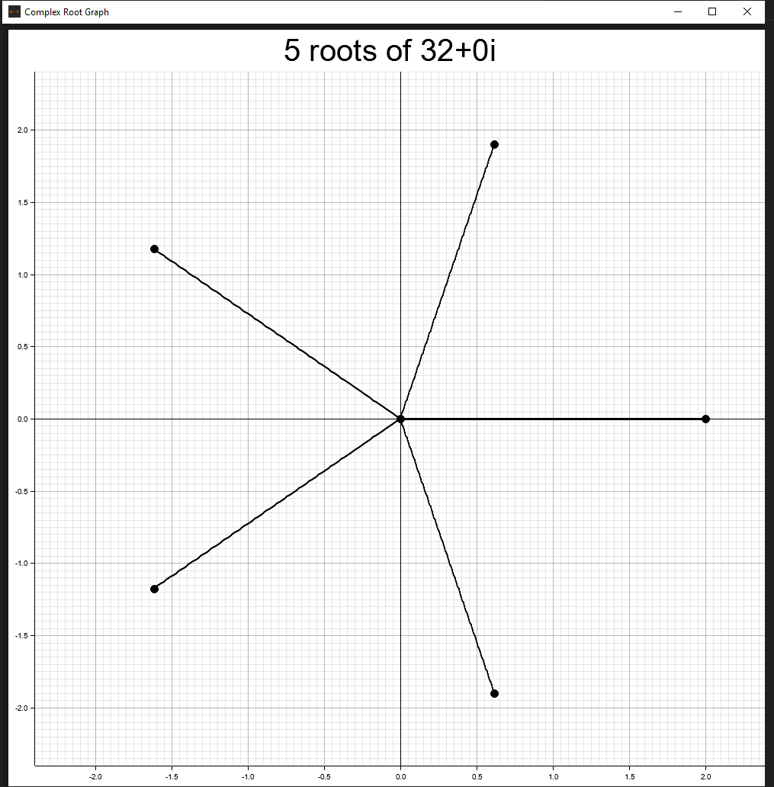

# Croot-Gui


> A Rust crate for graphing complex roots and numbers

# Context

This crate is designed to be paired with `croot`

- [Crate](https://www.crates.io/crates/croot)
- [Docs](https://www.docs.rs/croot)
- [Repo](https://www.github.com/Ross-Morgan/croot)

# Examples

## Create Graph

```rust
use croot_gui::prelude::*;

// Complex roots of a function
let roots = vec![ ... ];

// Name of file to generate
let filename = "graph.png";

// Size of image in pixels
let dimensions = (1000, 1000);

// Generate the graph with the selected parameters
generate_graph(roots, filename, dimensions).expect("Failed to generate graph");
```
## Display Graph

```rust
use croot_gui::prelude::*;

// Complex roots of a function
let roots = vec![ ... ];

// Size of image and window in pixels
let dimensions = (1000, 1000);

// Open a window containing the graph generated from the selected parameters
show_graph(roots, dimensions).expect("Failed to generator or display graph");
```

## Sample Output

This graph was generated from the 5th roots of 32 and is being displayed in 

